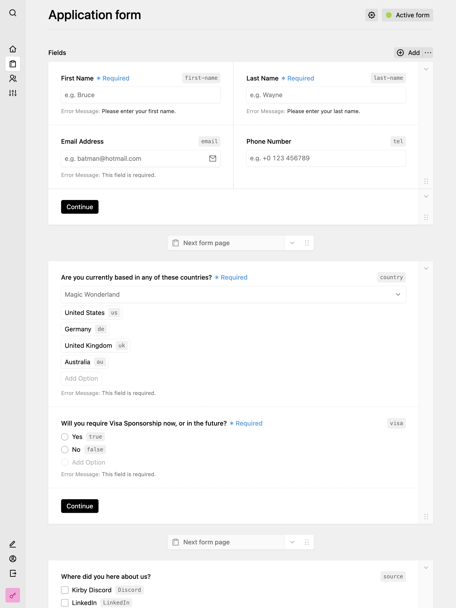

**DreamForm** is an opiniated form builder plugin for Kirby CMS 4+ that makes forms work like magic.

### Key features

- ✨ Create single or multi-step forms from the panel
- 📦 Ships with over ten included field types
- 🛣 Execute complex submission workflows without writing any code
- 🦸‍♂️ Protect your forms against spam with the built-in captcha guards
- 🚀 Build your own fields & actions using the simple and intuitive API
- ♻️ Compatible with any frontend, use API submissions or server-side rendering
- 🎨 No overriding of styles with !important, no outdated & proprietary JavaScript

The forms directory, and any form or submission are **just pages** with custom models. The plugin comes with included blueprints for the panel, snippets for rendering the forms, and of course anything related to handling form submission, validation or session handling. This way, it **feels just like Kirby.**

**DreamForm is not a 100% drop-in plugin** and does not render any pages containing forms on its own. You'll have to integrate the form field in a panel blueprint (where do you want the reference to a form be stored) and the form snippet in a template (where do you want the selected form to be output).

It also comes **without JS or CSS code**, so you can fully customize it to your sites' needs. However, examples are provided if you need a quick start.

---

## The Story behind DreamForm

After integrating forms in hundreds of websites (that's exaggerated, but it sounds better) in the past few years, I asked myself: "How can I make this tiring process easier and give my editors more possibilities they know from working with SaaS form builders like Typeform or Tally that pioneer in UX?"

When the next client reached out and told me they needed a contact form, I offered them to build a form as usual and started abstracting out all things that were possible to normalize in a plugin. At that point, they didn't know what I was building, it was just a normal form to them.

Months passed and I kept working on DreamForm after delivering the site, and made sure to always follow my core principles.

- **The Kirby Feeling:** DreamForm should feel like a native part of Kirby, not a third-party plugin
- **Getting naming right:** The average user doesn't understand what a "Textarea" is, but everyone can imagine what a "Multi-line Text" looks like
- **Extendability:** Kirby is easy to expand and makes it easy to go the extra-mile developing custom behaviours for clients - DreamForm should work the same
- **Power to the editors:** Editors should be able to do everything they want in the Panel, without touching code or breaking the site as a whole

Excited to try DreamForm now? I'm glad to be with you on your journey! 🚀
