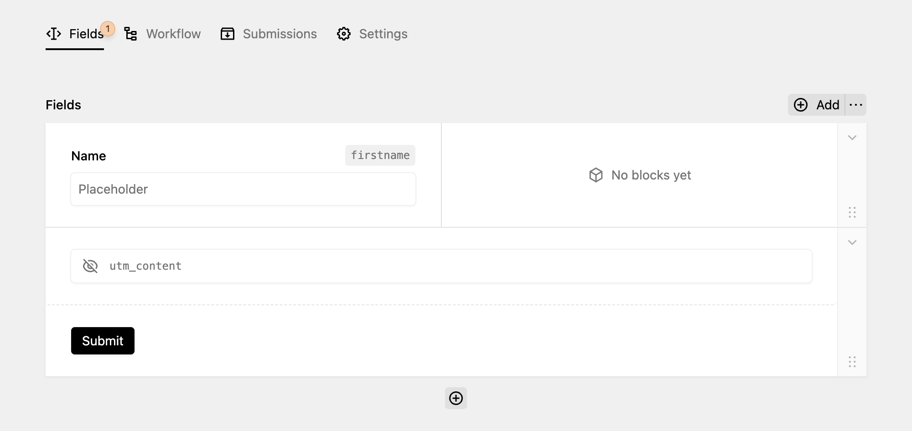

The form builder is at the core of DreamForm and works just like a Layout field that you know from Kirby Core.

When clicking on "Add" in the upper right corner, you can choose to create fields in either a full width or a half width split layout. You can customize the available layouts in the `config.php` file. You'll also have the option to [start a new page in a multi-step form.](./multi-step)

When clicking on an empty layout or selecting an existing field and clicking on the Plus icon in the toolbar, you can add a new field. You can [read more about the existing field types here.](../fields/what-are-fields)
