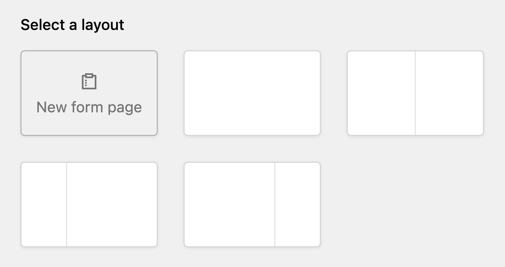
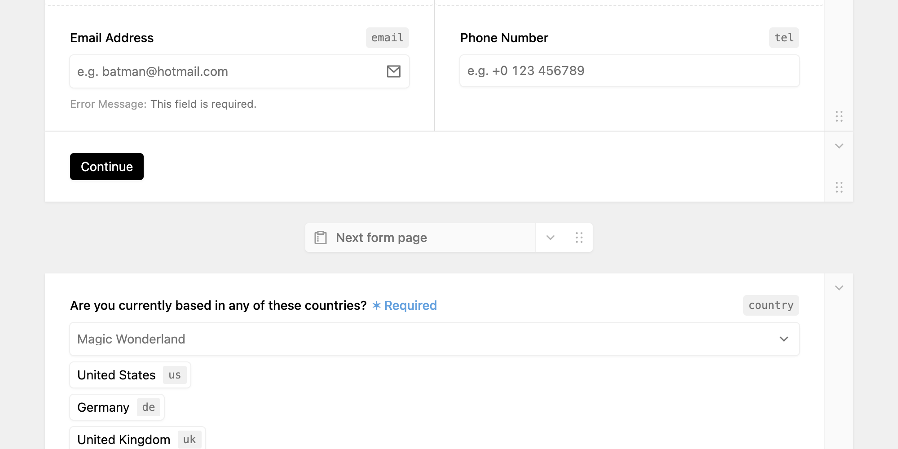

If your form is **complex and has lot of fields**, you may need to create additional pages, and split fields over multiple steps. The users have to submit each page manually. DreamForm has **built-in support for Multi-step forms.**

When users submit a multi-step form, a submission in the panel will be created with completing the first step and is shown as partial as indicated by the draft icon in the submissions list.

When a multi-step form is submitted, guards are executed on each step and the visible fields from the current step are validated. Actions however are only executed at the end of a submission and will not be executed for partial submissions that are never completed.

## Adding a multi-step form

To turn your form into a multi-step form, start by clicking the **"Add"** button for adding a new Layout in the upper right corner and select **"New form page"**. This block serves as a divider to separate Layouts into pages.

You can move this divider freely around and change the fields of your form pages as you'd like. It's important to ensure that **every form page has a Submit button field** included, so the users can continue to the next step.

## Technical limitations

Multi-step forms are supported by all submission modes (HTMX, PRG & API) - if you're using the API submission mode, you'll have to ensure to send the submission token and correct step with each additional request.
